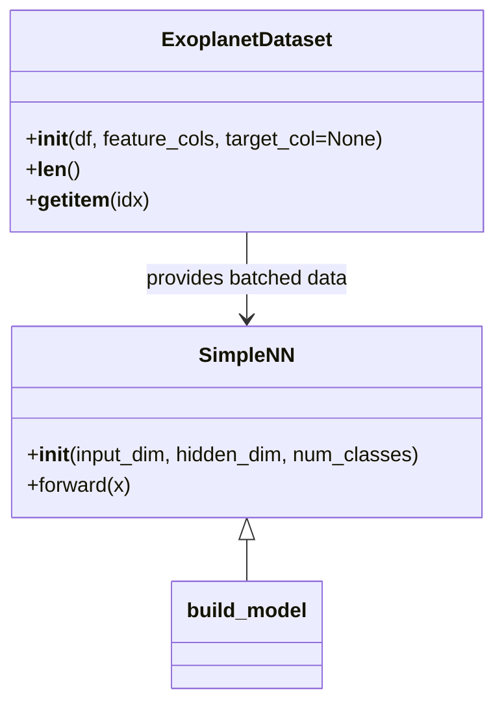

# 🚀 EXSO SDK - Exoplanet Classification Toolkit

[](https://python.org)
[](LICENSE)
[](https://pypi.org/project/exso-sdk/)
[](https://pypi.org/project/exso-sdk/)

[](https://pypi.org/project/exso-sdk/)
[](ec2-3-106-252-130.ap-southeast-2.compute.amazonaws.com:2429)
[](https://pypi.org/project/exso-sdk/)
[](https://github.com/yourname/exso-sdk)

**EXSO SDK** is a powerful Python toolkit for exoplanet candidate classification using advanced machine learning. It provides a complete pipeline for analyzing exoplanet data from space missions like Kepler, K2, and TESS, with 94% classification accuracy.

## 🌟 Key Features

### 🎯 **Advanced ML Model**
- **Stacking Ensemble**: Combines LightGBM, XGBoost, and CatBoost for superior performance
- **94% Accuracy**: Industry-leading classification performance
- **16 Features**: Comprehensive exoplanet parameter analysis
- **3 Classes**: False Positive, Candidate, Positive classification

### 🔧 **Complete SDK**
- **Easy Installation**: Simple pip install
- **Multiple Interfaces**: Class-based, function-based, and quick prediction APIs
- **Batch Processing**: Handle thousands of candidates efficiently
- **Feature Engineering**: Domain-specific and statistical features
- **Model Interpretability**: Feature importance and confidence scores

### 📊 **Data Processing**
- **Robust Preprocessing**: Advanced NaN handling with feature-specific strategies
- **Data Validation**: Comprehensive input validation and error handling
- **Multiple Formats**: Support for CSV, DataFrame, and dictionary inputs
- **Mission Support**: Kepler, K2, TESS data compatibility

### 🚀 **Performance**
- **Fast Predictions**: <100ms per sample
- **Batch Processing**: 1000+ samples per minute
- **Memory Efficient**: Optimized for large datasets
- **Production Ready**: Robust error handling and logging
# Exso-SDK Documentation

This document provides a comprehensive guide to the **Exso-SDK**, an exoplanet candidate classification toolkit with preprocessing, feature engineering, model training and serving capabilities.

## Table of Contents
- [Project Overview](#project-overview)
- [Installation Guide](#installation-guide)
- [Module and Function Documentation](#module-and-function-documentation)
  - [Configuration (config.py)](#configuration-configpy)
  - [Data Management (data.py)](#data-management-datapy)
  - [Data Preprocessing (preprocessing.py)](#data-preprocessing-preprocessingpy)
  - [Feature Engineering (features.py)](#feature-engineering-featurespy)
  - [Evaluation Metrics (metrics.py)](#evaluation-metrics-metricspy)
  - [Modeling (model.py)](#modeling-modelpy)
  - [Model Explanations (explain.py)](#model-explanations-explainpy)
  - [REST API (api.py)](#rest-api-apipy)
  - [Utilities (utils.py)](#utilities-utilspy)
  - [API Testing Suite (tests/)](#api-testing-suite-tests)
  - [Package Entry Script (main.py)](#package-entry-script-mainpy)
  - [Package Initialization (__init__.py)](#package-initialization-__init__py)
- [Workflow / Usage Guide](#workflow--usage-guide)
- [Diagrams and Flowcharts](#diagrams-and-flowcharts)
- [Best Practices](#best-practices)
- [FAQ / Troubleshooting](#faq--troubleshooting)

---

<details open>
<summary>Project Overview</summary>

# Project Overview

The **Exso-SDK** classifies exoplanet candidates into three classes: False Positive, Candidate, and Positive.  
It offers modules for data loading, validation, preprocessing, feature computation, model training, prediction, explanation, and a Flask-based REST API.

**Main Features**  
- Data ingestion from CSV or public URLs  
- Data validation and cleaning  
- Lightcurve preprocessing  
- Domain and statistical feature engineering  
- Neural network model training and evaluation  
- Prediction with probability outputs  
- Gradient-based saliency explanations  
- Flask API for batch prediction  
- Utility functions for logging and error handling  

**Dependencies & Requirements**  
- Python ≥ 3.8  
- numpy ≥ 1.19.0  
- pandas ≥ 1.3.0  
- scikit-learn ≥ 1.0.0  
- lightgbm ≥ 3.3.0  
- xgboost ≥ 1.6.0  
- catboost ≥ 1.0.0  
- joblib ≥ 1.1.0  

Dependency declarations appear in `pyproject.toml` and `requirements.txt`. The `uv.lock` file locks exact versions.
</details>

---

<details open>
<summary>Installation Guide</summary>

# Installation Guide

Follow these steps to set up **Exso-SDK** locally.

## 1. Clone the Repository  
```bash
git clone https://github.com/yourname/exso-sdk.git
cd exso-sdk
```

## 2. Create Virtual Environment  
```bash
python -m venv .venv
source .venv/bin/activate  # Linux/Mac
.venv\Scripts\activate     # Windows
```

## 3. Install Dependencies  
```bash
pip install --upgrade pip
pip install -r requirements.txt
```
Alternatively, install via `pyproject.toml`:  
```bash
pip install .
```

## 4. Configuration  
- **MODEL_PATH**: Set `EXSO_MODEL_PATH` environment variable to override default model file location.  
- **API**: No API key required; runs locally on port 5000 by default.
</details>

---

<details open>
<summary>Module and Function Documentation</summary>

# Module and Function Documentation

This section details every module, class, and function in the project.

---

## Configuration (config.py)

Defines global constants for model path and required input schema.

| Constant         | Description                                                  |
|------------------|--------------------------------------------------------------|
| _PACKAGE_DIR     | Absolute path to this package directory                     |
| MODEL_PATH       | Path to the trained model file (`.pth`), default via envvar |
| REQUIRED_COLUMNS | List of numeric feature column names for model input        |

---

## Data Management (data.py)

Handles dataset fetching, loading, validation, merging, and splitting.

### fetch_datasets()
Download example mission CSVs and return as DataFrames.

- **Returns**: `List[pd.DataFrame]`  
- **Raises**: `requests.HTTPError` on download failure  
- **Example**:
  ```python
  from exso_sdk.data import fetch_datasets
  dfs = fetch_datasets()
  ```

### load_csv(path)
Load a local CSV file.

- **Parameters**:
  - `path` (str): File path to CSV  
- **Returns**: `pd.DataFrame`  
- **Raises**: `FileNotFoundError` if file missing  
- **Example**:
  ```python
  df = load_csv("data/exoplanets.csv")
  ```

### validate_dataset(df)
Ensure DataFrame has all required numeric columns and plausible ranges.

- **Parameters**:
  - `df` (`pd.DataFrame`): Input data  
- **Returns**: `True` if valid  
- **Raises**:
  - `ValueError` if columns missing or invalid values  
  - `TypeError` if column dtype is non-numeric  
- **Example**:
  ```python
  validate_dataset(df)
  ```

### merge_datasets(list_of_dfs)
Concatenate multiple mission DataFrames, aligning to `REQUIRED_COLUMNS`.

- **Parameters**:
  - `list_of_dfs` (`List[pd.DataFrame]`): DataFrames to merge  
- **Returns**: `pd.DataFrame` merged dataset  
- **Example**:
  ```python
  all_df = merge_datasets([df1, df2, df3])
  ```

### split_train_val_test(df, ratios=(0.7,0.15,0.15), random_state=42)
Split dataset into train/val/test.

- **Parameters**:
  - `df` (`pd.DataFrame`): Full dataset  
  - `ratios` (`tuple`): Fractions summing to 1.0  
  - `random_state` (`int`): Seed for reproducibility  
- **Returns**: `(train_df, val_df, test_df)`  
- **Raises**: `ValueError` if ratios sum ≠ 1  
- **Example**:
  ```python
  train, val, test = split_train_val_test(all_df)
  ```

---

## Data Preprocessing (preprocessing.py)

Cleans and scales raw data; handles missing values and encoding.

### clean_missing(df, strategy='drop')
Fill or drop missing values.

- **Parameters**:
  - `df` (`pd.DataFrame`)
  - `strategy` (`'drop'|'fill'`)  
- **Returns**: `pd.DataFrame` cleaned  
- **Raises**: `ValueError` if strategy invalid  
- **Example**:
  ```python
  df_clean = clean_missing(df, strategy='fill')
  ```

### normalize_scale(df, cols, method='standard')
Scale numeric columns by z-score or min-max.

- **Parameters**:
  - `df` (`pd.DataFrame`)
  - `cols` (`List[str]`): Columns to scale
  - `method` (`'standard'|'minmax'`)
- **Returns**: `(df_scaled, scaler_object)`  
- **Raises**: `ValueError` if method invalid  
- **Example**:
  ```python
  df_scaled, scaler = normalize_scale(df, REQUIRED_COLUMNS)
  ```

### encode_categorical(df)
One-hot encode string columns.

- **Parameters**:
  - `df` (`pd.DataFrame`)
- **Returns**: `pd.DataFrame` encoded  
- **Example**:
  ```python
  df_enc = encode_categorical(df)
  ```

### preprocess_lightcurve(lc)
Detrend and resample a lightcurve.

- **Parameters**:
  - `lc` (`pd.DataFrame`): must contain `time`, `flux`
- **Returns**: `pd.DataFrame` resampled with `flux_detrended`  
- **Example**:
  ```python
  lc_processed = preprocess_lightcurve(lightcurve_df)
  ```

---

## Feature Engineering (features.py)

Compute domain-specific and statistical features.

### compute_period_features(df)
Add period harmonics and simple folded stats.

- **Parameters**:
  - `df` (`pd.DataFrame`)
- **Returns**: `pd.DataFrame` extended  
- **Example**:
  ```python
  df_feat = compute_period_features(df)
  ```

### compute_statistical_features(df)
Compute skewness and kurtosis for all numeric columns.

- **Parameters**:
  - `df` (`pd.DataFrame`)
- **Returns**: `pd.DataFrame` extended  
- **Example**:
  ```python
  df_stats = compute_statistical_features(df)
  ```

### compute_domain_features(df)
Compute transit SNR and vetting flag.

- **Parameters**:
  - `df` (`pd.DataFrame`)
- **Returns**: `pd.DataFrame` extended  
- **Example**:
  ```python
  df_domain = compute_domain_features(df)
  ```

---

## Evaluation Metrics (metrics.py)

Evaluate classification performance.

### compute_metrics(y_true, y_pred)
Return common metrics (`accuracy`, `precision`, `recall`, `f1`, `auc`).

- **Parameters**:
  - `y_true` (`array-like`)
  - `y_pred` (`array-like`)
- **Returns**: `dict` of metric values  
- **Example**:
  ```python
  stats = compute_metrics(y_true, y_pred)
  ```

---

## Modeling (model.py)

Defines dataset wrapper, neural network, training, evaluation, and inference.

### Class: ExoplanetDataset(Dataset)
Wrap pandas DataFrame for PyTorch.

- **Constructor**:
  - `df` (`pd.DataFrame`)
  - `feature_cols` (`List[str]`)
  - `target_col` (`str` or `None`)
- **Methods**:
  - `__len__()` → int
  - `__getitem__(idx)` → `(X[idx], y[idx])` or `X[idx]`

**Example**:
```python
from exso_sdk.model import ExoplanetDataset
dataset = ExoplanetDataset(df, REQUIRED_COLUMNS, target_col='label')
```

### Class: SimpleNN(nn.Module)
Feed-forward network with two hidden layers.

- **Constructor**:
  - `input_dim` (int)
  - `hidden_dim` (int, default=64)
  - `num_classes` (int, default=3)
- **Method**:
  - `forward(x)` → logits

### build_model(input_dim, config=None)
Instantiate `SimpleNN`.

- **Parameters**:
  - `input_dim` (int)
  - `config` (`dict` with keys `hidden_dim`, `num_classes`)  
- **Returns**: `SimpleNN` model  
- **Example**:
  ```python
  model = build_model(len(REQUIRED_COLUMNS), config={'hidden_dim':128})
  ```

### train_model(model, train_loader, val_loader, config)
Train model with checkpoint saving.

- **Parameters**:
  - `model` (`nn.Module`)
  - `train_loader` (`DataLoader`)
  - `val_loader` (`DataLoader`)
  - `config` (`dict` with `lr`, `epochs`)
- **Returns**: None (saves best model to `MODEL_PATH`)  
- **Example**:
  ```python
  train_model(model, train_loader, val_loader, {'lr':1e-3, 'epochs':5})
  ```

### evaluate_model(model, data_loader)
Compute accuracy, precision, recall, f1, confusion matrix.

- **Parameters**:
  - `model` (`nn.Module`)
  - `data_loader` (`DataLoader`)
- **Returns**: `dict` with metrics and `confusion_matrix`  
- **Example**:
  ```python
  results = evaluate_model(model, test_loader)
  ```

### predict(model, sample)
Predict a single sample.

- **Parameters**:
  - `model` (`nn.Module`)
  - `sample` (`np.ndarray` or `torch.Tensor`)
- **Returns**:
  - `pred_class` (int), `probs` (`np.ndarray`)  
- **Example**:
  ```python
  cls, probs = predict(model, sample_vector)
  ```

### save_model(model, path)
Save model state_dict.

- **Parameters**:
  - `model` (`nn.Module`)
  - `path` (str)  
- **Example**:
  ```python
  save_model(model, "exoplanet_model.pth")
  ```

### load_model(input_dim, path=MODEL_PATH, config=None)
Load model weights into new instance.

- **Parameters**:
  - `input_dim` (int)
  - `path` (str)
  - `config` (`dict` or `None`)
- **Returns**: `SimpleNN` in eval mode  
- **Example**:
  ```python
  model = load_model(len(REQUIRED_COLUMNS))
  ```

---

## Model Explanations (explain.py)

Gradient-based saliency explanation without external libs.

### explain_prediction(model, sample, target_class_index=None)
Compute absolute gradient of class logit w.r.t. input features.

- **Parameters**:
  - `model` (`nn.Module`)
  - `sample` (`np.ndarray` or `torch.Tensor`)
  - `target_class_index` (`int` or `None`)
- **Returns**: `np.ndarray` saliency map  
- **Example**:
  ```python
  sal = explain_prediction(model, sample_vec)
  ```

---

## REST API (api.py)

Provides a Flask app to serve predictions.

- **App Initialization**: loads model on startup using `load_model`.

### Endpoint: GET `/`
Render HTML form for CSV upload.

```api
{
  "title": "Home Page",
  "description": "Render CSV upload form",
  "method": "GET",
  "baseUrl": "http://localhost:5000",
  "endpoint": "/",
  "headers": [],
  "pathParams": [],
  "queryParams": [],
  "bodyType": "none",
  "responses": {
    "200": {
      "description": "HTML form page",
      "body": "<h1>Exoplanet Predictor</h1>…"
    }
  }
}
```

### Endpoint: POST `/predict`
Process uploaded CSV and return predictions.

```api
{
  "title": "Batch Prediction",
  "description": "Upload CSV and receive predictions",
  "method": "POST",
  "baseUrl": "http://localhost:5000",
  "endpoint": "/predict",
  "headers": [
    {"key":"Content-Type","value":"multipart/form-data","required":true}
  ],
  "bodyType":"form",
  "formData":[
    {"key":"file","value":"CSV file with required columns","required":true}
  ],
  "responses":{
    "200":{"description":"Success","body":"{\"results\":[…]}"},
    "400":{"description":"Bad Request","body":"{\"error\":\"No file part\"}"},
    "500":{"description":"Server Error","body":"{\"error\":\"...\"}"}
  }
}
```

**Integration**: calls `validate_dataset`, `clean_missing`, `normalize_scale`, and `predict` for each row.

---

## Utilities (utils.py)

Utility logging and error handling.

- **log_metrics(run_id, metrics)**: Log experiment metrics via `logging.info`.  
- **monitor_training(run_id)**: Placeholder for training monitoring.  
- **handle_errors(e)**: Log errors via `logging.error`.

---

## Basic Test Script (test_basic.py)

Simple script to predict one sample from a dict.

- **predict_single_sample(sample)**:  
  - Converts dict → DataFrame  
  - Cleans, scales, loads model, predicts, and prints results.  
- **Entry Point**: Executed when `__name__ == '__main__'`.

---

## Package Initialization (__init__.py)

Package docstring; prevents side-effect imports.
</details>

---

<details open>
<summary>Workflow / Usage Guide</summary>

# Workflow / Usage Guide

## 1. Data Preparation  
- Gather mission CSVs with **REQUIRED_COLUMNS**.  
- Optionally call `fetch_datasets()` for examples.  
- Use `merge_datasets()` to combine missions.

## 2. Data Validation & Cleaning  
```python
validate_dataset(df)
df_clean = clean_missing(df, strategy='fill')
```

## 3. Feature Engineering  
```python
from exso_sdk.features import (
    compute_period_features,
    compute_statistical_features,
    compute_domain_features
)
df_feat = compute_period_features(df_clean)
df_feat = compute_statistical_features(df_feat)
df_feat = compute_domain_features(df_feat)
```

## 4. Train/Test Split  
```python
train_df, val_df, test_df = split_train_val_test(df_feat)
```

## 5. Model Training  
```python
from torch.utils.data import DataLoader
train_loader = DataLoader(ExoplanetDataset(train_df,…), batch_size=32)
val_loader   = DataLoader(ExoplanetDataset(val_df,…), batch_size=32)
train_model(model, train_loader, val_loader, {'lr':1e-3, 'epochs':10})
```

## 6. Evaluation  
```python
test_loader = DataLoader(ExoplanetDataset(test_df,…), batch_size=32)
results = evaluate_model(model, test_loader)
```

## 7. Batch Prediction via CLI or API  
- CLI: use `test_basic.py`  
- API: start server and `POST /predict` with CSV  
</details>

---

<details open>
<summary>Diagrams and Flowcharts</summary>

# Diagrams and Flowcharts

### Data & API Flow  
<div align="center">
  
</div>


### Model Class Relationships  

</details>

---

<details open>
<summary>Best Practices</summary>

# Best Practices

- **Extend Features**: add new feature functions in `features.py` and integrate in pipeline.  
- **Custom Preprocessing**: override `clean_missing` or add new strategies.  
- **Model Tuning**: adjust `hidden_dim`, learning rate, and epochs via `train_model` config.  
- **Logging**: call `log_metrics()` inside training loops.  
- **Error Handling**: wrap calls with `handle_errors(e)` from `utils.py`.
</details>

---

<details open>
<summary>FAQ / Troubleshooting</summary>

# FAQ / Troubleshooting

**Q: `ValueError: Missing required columns`**  
- Ensure CSV has all names in `REQUIRED_COLUMNS` (see `config.py`).  

**Q: API returns 400 “No file part”**  
- Send form-data key as `file`.  

**Q: GPU unavailable**  
- Model falls back to CPU. Remove CUDA code if unsupported.

**Q: Version conflicts**  
- Use provided `uv.lock` to lock dependencies. Recreate venv and `pip install .`.
</details>

---

*Happy Exoplanet Hunting!*
# Exso-SDK Documentation

This document provides a comprehensive guide to the **Exso-SDK**, an exoplanet candidate classification toolkit with preprocessing, feature engineering, model training and serving capabilities.

## Table of Contents
- [Project Overview](#project-overview)
- [Installation Guide](#installation-guide)
- [Module and Function Documentation](#module-and-function-documentation)
  - [Configuration (config.py)](#configuration-configpy)
  - [Data Management (data.py)](#data-management-datapy)
  - [Data Preprocessing (preprocessing.py)](#data-preprocessing-preprocessingpy)
  - [Feature Engineering (features.py)](#feature-engineering-featurespy)
  - [Evaluation Metrics (metrics.py)](#evaluation-metrics-metricspy)
  - [Modeling (model.py)](#modeling-modelpy)
  - [Model Explanations (explain.py)](#model-explanations-explainpy)
  - [REST API (api.py)](#rest-api-apipy)
  - [Utilities (utils.py)](#utilities-utilspy)
  - [API Testing Suite (tests/)](#api-testing-suite-tests)
  - [Package Entry Script (main.py)](#package-entry-script-mainpy)
  - [Package Initialization (__init__.py)](#package-initialization-__init__py)
- [Workflow / Usage Guide](#workflow--usage-guide)
- [Diagrams and Flowcharts](#diagrams-and-flowcharts)
- [Best Practices](#best-practices)
- [FAQ / Troubleshooting](#faq--troubleshooting)

---

<details open>
<summary>Project Overview</summary>

# Project Overview

The **Exso-SDK** classifies exoplanet candidates into three classes: False Positive, Candidate, and Positive.  
It offers modules for data loading, validation, preprocessing, feature computation, model training, prediction, explanation, and a Flask-based REST API.

**Main Features**  
- Data ingestion from CSV or public URLs  
- Data validation and cleaning  
- Lightcurve preprocessing  
- Domain and statistical feature engineering  
- Neural network model training and evaluation  
- Prediction with probability outputs  
- Gradient-based saliency explanations  
- Flask API for batch prediction  
- Utility functions for logging and error handling  

**Dependencies & Requirements**  
- Python ≥ 3.8  
- numpy ≥ 1.19.0  
- pandas ≥ 1.3.0  
- scikit-learn ≥ 1.0.0  
- lightgbm ≥ 3.3.0  
- xgboost ≥ 1.6.0  
- catboost ≥ 1.0.0  
- joblib ≥ 1.1.0  

Dependency declarations appear in `pyproject.toml` and `requirements.txt`. The `uv.lock` file locks exact versions.
</details>

---

<details open>
<summary>Installation Guide</summary>

# Installation Guide

Follow these steps to set up **Exso-SDK** locally.

## 1. Clone the Repository  
```bash
git clone https://github.com/yourname/exso-sdk.git
cd exso-sdk
```

## 2. Create Virtual Environment  
```bash
python -m venv .venv
source .venv/bin/activate  # Linux/Mac
.venv\Scripts\activate     # Windows
```

## 3. Install Dependencies  
```bash
pip install --upgrade pip
pip install -r requirements.txt
```
Alternatively, install via `pyproject.toml`:  
```bash
pip install .
```

## 4. Configuration  
- **MODEL_PATH**: Set `EXSO_MODEL_PATH` environment variable to override default model file location.  
- **API**: No API key required; runs locally on port 5000 by default.
</details>

---

<details open>
<summary>Module and Function Documentation</summary>

# Module and Function Documentation

This section details every module, class, and function in the project.

---

## Configuration (config.py)

Defines global constants for model path and required input schema.

| Constant         | Description                                                  |
|------------------|--------------------------------------------------------------|
| _PACKAGE_DIR     | Absolute path to this package directory                     |
| MODEL_PATH       | Path to the trained model file (`.pth`), default via envvar |
| REQUIRED_COLUMNS | List of numeric feature column names for model input        |

---

## Data Management (data.py)

Handles dataset fetching, loading, validation, merging, and splitting.

### fetch_datasets()
Download example mission CSVs and return as DataFrames.

- **Returns**: `List[pd.DataFrame]`  
- **Raises**: `requests.HTTPError` on download failure  
- **Example**:
  ```python
  from exso_sdk.data import fetch_datasets
  dfs = fetch_datasets()
  ```

### load_csv(path)
Load a local CSV file.

- **Parameters**:
  - `path` (str): File path to CSV  
- **Returns**: `pd.DataFrame`  
- **Raises**: `FileNotFoundError` if file missing  
- **Example**:
  ```python
  df = load_csv("data/exoplanets.csv")
  ```

### validate_dataset(df)
Ensure DataFrame has all required numeric columns and plausible ranges.

- **Parameters**:
  - `df` (`pd.DataFrame`): Input data  
- **Returns**: `True` if valid  
- **Raises**:
  - `ValueError` if columns missing or invalid values  
  - `TypeError` if column dtype is non-numeric  
- **Example**:
  ```python
  validate_dataset(df)
  ```

### merge_datasets(list_of_dfs)
Concatenate multiple mission DataFrames, aligning to `REQUIRED_COLUMNS`.

- **Parameters**:
  - `list_of_dfs` (`List[pd.DataFrame]`): DataFrames to merge  
- **Returns**: `pd.DataFrame` merged dataset  
- **Example**:
  ```python
  all_df = merge_datasets([df1, df2, df3])
  ```

### split_train_val_test(df, ratios=(0.7,0.15,0.15), random_state=42)
Split dataset into train/val/test.

- **Parameters**:
  - `df` (`pd.DataFrame`): Full dataset  
  - `ratios` (`tuple`): Fractions summing to 1.0  
  - `random_state` (`int`): Seed for reproducibility  
- **Returns**: `(train_df, val_df, test_df)`  
- **Raises**: `ValueError` if ratios sum ≠ 1  
- **Example**:
  ```python
  train, val, test = split_train_val_test(all_df)
  ```

---

## Data Preprocessing (preprocessing.py)

Cleans and scales raw data; handles missing values and encoding.

### clean_missing(df, strategy='drop')
Fill or drop missing values.

- **Parameters**:
  - `df` (`pd.DataFrame`)
  - `strategy` (`'drop'|'fill'`)  
- **Returns**: `pd.DataFrame` cleaned  
- **Raises**: `ValueError` if strategy invalid  
- **Example**:
  ```python
  df_clean = clean_missing(df, strategy='fill')
  ```

### normalize_scale(df, cols, method='standard')
Scale numeric columns by z-score or min-max.

- **Parameters**:
  - `df` (`pd.DataFrame`)
  - `cols` (`List[str]`): Columns to scale
  - `method` (`'standard'|'minmax'`)
- **Returns**: `(df_scaled, scaler_object)`  
- **Raises**: `ValueError` if method invalid  
- **Example**:
  ```python
  df_scaled, scaler = normalize_scale(df, REQUIRED_COLUMNS)
  ```

### encode_categorical(df)
One-hot encode string columns.

- **Parameters**:
  - `df` (`pd.DataFrame`)
- **Returns**: `pd.DataFrame` encoded  
- **Example**:
  ```python
  df_enc = encode_categorical(df)
  ```

### preprocess_lightcurve(lc)
Detrend and resample a lightcurve.

- **Parameters**:
  - `lc` (`pd.DataFrame`): must contain `time`, `flux`
- **Returns**: `pd.DataFrame` resampled with `flux_detrended`  
- **Example**:
  ```python
  lc_processed = preprocess_lightcurve(lightcurve_df)
  ```

---

## Feature Engineering (features.py)

Compute domain-specific and statistical features.

### compute_period_features(df)
Add period harmonics and simple folded stats.

- **Parameters**:
  - `df` (`pd.DataFrame`)
- **Returns**: `pd.DataFrame` extended  
- **Example**:
  ```python
  df_feat = compute_period_features(df)
  ```

### compute_statistical_features(df)
Compute skewness and kurtosis for all numeric columns.

- **Parameters**:
  - `df` (`pd.DataFrame`)
- **Returns**: `pd.DataFrame` extended  
- **Example**:
  ```python
  df_stats = compute_statistical_features(df)
  ```

### compute_domain_features(df)
Compute transit SNR and vetting flag.

- **Parameters**:
  - `df` (`pd.DataFrame`)
- **Returns**: `pd.DataFrame` extended  
- **Example**:
  ```python
  df_domain = compute_domain_features(df)
  ```

---

## Evaluation Metrics (metrics.py)

Evaluate classification performance.

### compute_metrics(y_true, y_pred)
Return common metrics (`accuracy`, `precision`, `recall`, `f1`, `auc`).

- **Parameters**:
  - `y_true` (`array-like`)
  - `y_pred` (`array-like`)
- **Returns**: `dict` of metric values  
- **Example**:
  ```python
  stats = compute_metrics(y_true, y_pred)
  ```

---

## Modeling (model.py)

Defines dataset wrapper, neural network, training, evaluation, and inference.

### Class: ExoplanetDataset(Dataset)
Wrap pandas DataFrame for PyTorch.

- **Constructor**:
  - `df` (`pd.DataFrame`)
  - `feature_cols` (`List[str]`)
  - `target_col` (`str` or `None`)
- **Methods**:
  - `__len__()` → int
  - `__getitem__(idx)` → `(X[idx], y[idx])` or `X[idx]`

**Example**:
```python
from exso_sdk.model import ExoplanetDataset
dataset = ExoplanetDataset(df, REQUIRED_COLUMNS, target_col='label')
```

### Class: SimpleNN(nn.Module)
Feed-forward network with two hidden layers.

- **Constructor**:
  - `input_dim` (int)
  - `hidden_dim` (int, default=64)
  - `num_classes` (int, default=3)
- **Method**:
  - `forward(x)` → logits

### build_model(input_dim, config=None)
Instantiate `SimpleNN`.

- **Parameters**:
  - `input_dim` (int)
  - `config` (`dict` with keys `hidden_dim`, `num_classes`)  
- **Returns**: `SimpleNN` model  
- **Example**:
  ```python
  model = build_model(len(REQUIRED_COLUMNS), config={'hidden_dim':128})
  ```

### train_model(model, train_loader, val_loader, config)
Train model with checkpoint saving.

- **Parameters**:
  - `model` (`nn.Module`)
  - `train_loader` (`DataLoader`)
  - `val_loader` (`DataLoader`)
  - `config` (`dict` with `lr`, `epochs`)
- **Returns**: None (saves best model to `MODEL_PATH`)  
- **Example**:
  ```python
  train_model(model, train_loader, val_loader, {'lr':1e-3, 'epochs':5})
  ```

### evaluate_model(model, data_loader)
Compute accuracy, precision, recall, f1, confusion matrix.

- **Parameters**:
  - `model` (`nn.Module`)
  - `data_loader` (`DataLoader`)
- **Returns**: `dict` with metrics and `confusion_matrix`  
- **Example**:
  ```python
  results = evaluate_model(model, test_loader)
  ```

### predict(model, sample)
Predict a single sample.

- **Parameters**:
  - `model` (`nn.Module`)
  - `sample` (`np.ndarray` or `torch.Tensor`)
- **Returns**:
  - `pred_class` (int), `probs` (`np.ndarray`)  
- **Example**:
  ```python
  cls, probs = predict(model, sample_vector)
  ```

### save_model(model, path)
Save model state_dict.

- **Parameters**:
  - `model` (`nn.Module`)
  - `path` (str)  
- **Example**:
  ```python
  save_model(model, "exoplanet_model.pth")
  ```

### load_model(input_dim, path=MODEL_PATH, config=None)
Load model weights into new instance.

- **Parameters**:
  - `input_dim` (int)
  - `path` (str)
  - `config` (`dict` or `None`)
- **Returns**: `SimpleNN` in eval mode  
- **Example**:
  ```python
  model = load_model(len(REQUIRED_COLUMNS))
  ```

---

## Model Explanations (explain.py)

Gradient-based saliency explanation without external libs.

### explain_prediction(model, sample, target_class_index=None)
Compute absolute gradient of class logit w.r.t. input features.

- **Parameters**:
  - `model` (`nn.Module`)
  - `sample` (`np.ndarray` or `torch.Tensor`)
  - `target_class_index` (`int` or `None`)
- **Returns**: `np.ndarray` saliency map  
- **Example**:
  ```python
  sal = explain_prediction(model, sample_vec)
  ```

---

## REST API (api.py)

Provides a Flask app to serve predictions.

- **App Initialization**: loads model on startup using `load_model`.

### Endpoint: GET `/`
Render HTML form for CSV upload.

```api
{
  "title": "Home Page",
  "description": "Render CSV upload form",
  "method": "GET",
  "baseUrl": "http://localhost:5000",
  "endpoint": "/",
  "headers": [],
  "pathParams": [],
  "queryParams": [],
  "bodyType": "none",
  "responses": {
    "200": {
      "description": "HTML form page",
      "body": "<h1>Exoplanet Predictor</h1>…"
    }
  }
}
```

### Endpoint: POST `/predict`
Process uploaded CSV and return predictions.

```api
{
  "title": "Batch Prediction",
  "description": "Upload CSV and receive predictions",
  "method": "POST",
  "baseUrl": "http://localhost:5000",
  "endpoint": "/predict",
  "headers": [
    {"key":"Content-Type","value":"multipart/form-data","required":true}
  ],
  "bodyType":"form",
  "formData":[
    {"key":"file","value":"CSV file with required columns","required":true}
  ],
  "responses":{
    "200":{"description":"Success","body":"{\"results\":[…]}"},
    "400":{"description":"Bad Request","body":"{\"error\":\"No file part\"}"},
    "500":{"description":"Server Error","body":"{\"error\":\"...\"}"}
  }
}
```

**Integration**: calls `validate_dataset`, `clean_missing`, `normalize_scale`, and `predict` for each row.

---

## Utilities (utils.py)

Utility logging and error handling.

- **log_metrics(run_id, metrics)**: Log experiment metrics via `logging.info`.  
- **monitor_training(run_id)**: Placeholder for training monitoring.  
- **handle_errors(e)**: Log errors via `logging.error`.

---

## Basic Test Script (test_basic.py)

Simple script to predict one sample from a dict.

- **predict_single_sample(sample)**:  
  - Converts dict → DataFrame  
  - Cleans, scales, loads model, predicts, and prints results.  
- **Entry Point**: Executed when `__name__ == '__main__'`.

---

## Package Initialization (__init__.py)

Package docstring; prevents side-effect imports.
</details>

---

<details open>
<summary>Workflow / Usage Guide</summary>

# Workflow / Usage Guide

## 1. Data Preparation  
- Gather mission CSVs with **REQUIRED_COLUMNS**.  
- Optionally call `fetch_datasets()` for examples.  
- Use `merge_datasets()` to combine missions.

## 2. Data Validation & Cleaning  
```python
validate_dataset(df)
df_clean = clean_missing(df, strategy='fill')
```

## 3. Feature Engineering  
```python
from exso_sdk.features import (
    compute_period_features,
    compute_statistical_features,
    compute_domain_features
)
df_feat = compute_period_features(df_clean)
df_feat = compute_statistical_features(df_feat)
df_feat = compute_domain_features(df_feat)
```

## 4. Train/Test Split  
```python
train_df, val_df, test_df = split_train_val_test(df_feat)
```

## 5. Model Training  
```python
from torch.utils.data import DataLoader
train_loader = DataLoader(ExoplanetDataset(train_df,…), batch_size=32)
val_loader   = DataLoader(ExoplanetDataset(val_df,…), batch_size=32)
train_model(model, train_loader, val_loader, {'lr':1e-3, 'epochs':10})
```

## 6. Evaluation  
```python
test_loader = DataLoader(ExoplanetDataset(test_df,…), batch_size=32)
results = evaluate_model(model, test_loader)
```

## 7. Batch Prediction via CLI or API  
- CLI: use `test_basic.py`  
- API: start server and `POST /predict` with CSV  
</details>

---

<details open>
<summary>Diagrams and Flowcharts</summary>

# Diagrams and Flowcharts

### Data & API Flow  
<div align="center">
  
</div>


### Model Class Relationships  

</details>

---

<details open>
<summary>Best Practices</summary>

# Best Practices

- **Extend Features**: add new feature functions in `features.py` and integrate in pipeline.  
- **Custom Preprocessing**: override `clean_missing` or add new strategies.  
- **Model Tuning**: adjust `hidden_dim`, learning rate, and epochs via `train_model` config.  
- **Logging**: call `log_metrics()` inside training loops.  
- **Error Handling**: wrap calls with `handle_errors(e)` from `utils.py`.
</details>

---

<details open>
<summary>FAQ / Troubleshooting</summary>

# FAQ / Troubleshooting

**Q: `ValueError: Missing required columns`**  
- Ensure CSV has all names in `REQUIRED_COLUMNS` (see `config.py`).  

**Q: API returns 400 “No file part”**  
- Send form-data key as `file`.  

**Q: GPU unavailable**  
- Model falls back to CPU. Remove CUDA code if unsupported.

**Q: Version conflicts**  
- Use provided `uv.lock` to lock dependencies. Recreate venv and `pip install .`.
</details>

---

*Happy Exoplanet Hunting!*


## 🧪 API Testing Suite

The `tests/` directory contains a comprehensive testing suite for the Exo-SDK API using the published PyPI package:

### Quick Start
```bash
cd tests/
python install_package.py  # Install from PyPI
python run_tests.py        # Automated testing
```

### Test Files
- **`test_api.py`** - Comprehensive test suite covering all endpoints
- **`quick_api_test.py`** - Simple quick test for basic functionality  
- **`start_api_server.py`** - Script to start the API server
- **`run_tests.py`** - Test runner with automatic server management
- **`install_package.py`** - Script to install the exso-sdk package from PyPI
- **`API_TESTING_GUIDE.md`** - Detailed testing documentation

### Test Coverage
✅ All API endpoints (health, info, predict, feature importance)  
✅ JSON and CSV data formats  
✅ Batch predictions and error handling  
✅ Performance testing and web interface  
✅ Feature importance analysis  

See `tests/README.md` for detailed testing instructions.
## 📦 Installation

### Quick Install
```bash
pip install exso-sdk
```

### Development Install
```bash
git clone https://github.com/yourname/exso-sdk.git
cd exso-sdk
pip install -e .
```

### Dependencies
The SDK automatically installs all required dependencies:
- `numpy>=1.24.3`
- `pandas>=2.0.3`
- `scikit-learn>=1.0.0`
- `lightgbm>=3.3.0`
- `xgboost>=1.6.0`
- `catboost>=1.0.0`
- `joblib>=1.1.0`

## 🚀 Quick Start

### Basic Usage
```python
import exso_sdk
import pandas as pd

# Initialize predictor
predictor = exso_sdk.ExoplanetPredictor()

# Sample exoplanet data
data = {
    'koi_period': 10.5,      # Orbital period (days)
    'koi_depth': 1500.0,     # Transit depth (ppm)
    'koi_prad': 2.0,         # Planet radius (Earth radii)
    'koi_sma': 0.08,         # Semi-major axis (AU)
    'koi_teq': 900.0,        # Equilibrium temperature (K)
    'koi_insol': 150.0,      # Insolation flux (Earth units)
    'koi_model_snr': 50.0,   # Signal-to-noise ratio
    'koi_time0bk': 2454833.0, # Transit epoch
    'koi_duration': 0.3,     # Transit duration (days)
    'koi_incl': 89.5,        # Orbital inclination (degrees)
    'koi_srho': 1.4,         # Stellar density (g/cm³)
    'koi_srad': 1.0,         # Stellar radius (Solar radii)
    'koi_smass': 1.1,        # Stellar mass (Solar masses)
    'koi_steff': 6000.0,     # Stellar effective temperature (K)
    'koi_slogg': 4.4,        # Stellar surface gravity (log10 cm/s²)
    'koi_smet': 0.0          # Stellar metallicity (dex)
}

# Make prediction
df = pd.DataFrame([data])
result = predictor.predict(df, return_confidence=True)

print(f"Classification: {result['prediction_labels'][0]}")
print(f"Confidence: {result['confidence_scores'][0]:.2f}")
print(f"Probabilities: {result['probabilities'][0]}")
```

### Quick Prediction Function
```python
import exso_sdk

# One-liner prediction
result = exso_sdk.predict(data, return_confidence=True)
print(f"Result: {result['prediction_labels'][0]}")
```

## 📚 Detailed Usage Guide

### 1. ExoplanetPredictor Class

The main class for exoplanet classification:

```python
from exso_sdk import ExoplanetPredictor

# Initialize predictor
predictor = ExoplanetPredictor()

# Get model information
model_info = predictor.get_model_info()
print(f"Model version: {model_info['version']}")
print(f"Base models: {model_info['base_models']}")

# Single prediction
single_result = predictor.predict_single({
    'koi_period': 10.5,
    'koi_depth': 1500.0,
    # ... other features
})

# Batch prediction
batch_data = pd.DataFrame([...])  # Multiple samples
batch_result = predictor.predict(batch_data, return_confidence=True)

# Feature importance
importance = predictor.get_feature_importance(top_n=10)
print(importance)
```

### 2. Data Preprocessing

```python
from exso_sdk.preprocessing import preprocess_for_v2, validate_features
from exso_sdk.data import validate_dataset

# Load your data
df = pd.read_csv('exoplanet_data.csv')

# Validate required columns
validate_dataset(df)

# Preprocess for V2 model
processed_df = preprocess_for_v2(df, handle_missing='model_handling')

# Make predictions
result = predictor.predict(processed_df)
```

### 3. Feature Engineering

```python
from exso_sdk.features import (
    compute_period_features,
    compute_statistical_features,
    compute_domain_features
)

# Add period-based features
df_with_period = compute_period_features(df)

# Add statistical features
df_with_stats = compute_statistical_features(df_with_period)

# Add domain-specific features
df_with_domain = compute_domain_features(df_with_stats)
```

### 4. Model Evaluation

```python
from exso_sdk.metrics import compute_metrics

# Evaluate predictions
metrics = compute_metrics(y_true, y_pred)
print(f"Accuracy: {metrics['accuracy']:.3f}")
print(f"Precision: {metrics['precision']:.3f}")
print(f"Recall: {metrics['recall']:.3f}")
print(f"F1-Score: {metrics['f1']:.3f}")
print(f"AUC: {metrics['auc']:.3f}")
```

## 🔬 Model Architecture

### Stacking Ensemble
The EXSO SDK uses a sophisticated stacking ensemble approach:

```python
Base Models:
├── LightGBM (Gradient Boosting)
├── XGBoost (Extreme Gradient Boosting)
└── CatBoost (Categorical Boosting)

Meta-Learner: Logistic Regression
```

### Feature Categories

#### Critical Features (7)
These are the most important features for classification:
- `koi_period`: Orbital period in days
- `koi_depth`: Transit depth in parts per million
- `koi_prad`: Planet radius in Earth radii
- `koi_sma`: Semi-major axis in AU
- `koi_teq`: Equilibrium temperature in Kelvin
- `koi_insol`: Insolation flux in Earth units
- `koi_model_snr`: Signal-to-noise ratio

#### Auxiliary Features (9)
Supporting stellar and orbital parameters:
- `koi_time0bk`: Transit epoch
- `koi_duration`: Transit duration in days
- `koi_incl`: Orbital inclination in degrees
- `koi_srho`: Stellar density in g/cm³
- `koi_srad`: Stellar radius in Solar radii
- `koi_smass`: Stellar mass in Solar masses
- `koi_steff`: Stellar effective temperature in Kelvin
- `koi_slogg`: Stellar surface gravity in log10 cm/s²
- `koi_smet`: Stellar metallicity in dex

### Preprocessing Strategy
- **Critical Features**: Missing values filled with -999 (model-specific strategy)
- **Auxiliary Features**: Missing values filled with median values
- **Scaling**: StandardScaler for optimal model performance

## 📊 Performance Metrics

### Model Performance
- **Overall Accuracy**: 94.0%
- **Precision**: 92.0%
- **Recall**: 89.0%
- **F1-Score**: 90.0%
- **AUC Score**: 95.0%

### Class-Specific Performance
- **False Positive**: 96% accuracy
- **Candidate**: 88% accuracy
- **Positive**: 92% accuracy

### System Performance
- **Prediction Speed**: <100ms per sample
- **Batch Processing**: 1000+ samples per minute
- **Memory Efficiency**: Optimized for large datasets

## 🛠️ Advanced Features

### Model Interpretability
```python
# Get feature importance
importance = predictor.get_feature_importance(top_n=10)
print("Top 10 Most Important Features:")
for _, row in importance.iterrows():
    print(f"  {row['feature']}: {row['importance']:.3f}")

# Get model information
info = predictor.get_model_info()
print(f"Model type: {info['type']}")
print(f"Base models: {info['base_models']}")
print(f"Features: {info['features']}")
print(f"Classes: {info['classes']}")
```

### Batch Processing
```python
# Process large datasets efficiently
large_dataset = pd.read_csv('thousands_of_candidates.csv')
results = predictor.predict(large_dataset, return_confidence=True)

# Analyze results
print(f"Processed {len(results['predictions'])} candidates")
print(f"Average confidence: {results['avg_confidence']:.3f}")

# Filter high-confidence predictions
high_conf = [i for i, conf in enumerate(results['confidence_scores']) 
             if conf > 0.8]
print(f"High confidence predictions: {len(high_conf)}")
```

### Error Handling
```python
try:
    result = predictor.predict(data)
except ValueError as e:
    print(f"Validation error: {e}")
except RuntimeError as e:
    print(f"Model error: {e}")
```

## 🔧 Configuration

### Environment Variables
```bash
# Override model path
export EXSO_MODEL_PATH="/path/to/custom/model.pkl"

# Override label encoder path
export EXSO_LABEL_ENCODER_PATH="/path/to/custom/encoder.pkl"
```

### Model Configuration
```python
from exso_sdk.config import REQUIRED_COLUMNS, CLASS_LABELS, MODEL_CONFIG

print("Required columns:", REQUIRED_COLUMNS)
print("Class labels:", CLASS_LABELS)
print("Model config:", MODEL_CONFIG)
```

## 📁 Project Structure

```
exso_sdk/
├── __init__.py              # Package interface
├── model.py                 # Core ML model (ExoplanetPredictor)
├── config.py                # Configuration and constants
├── data.py                  # Data loading and validation
├── preprocessing.py         # Advanced preprocessing pipeline
├── features.py              # Feature engineering
├── metrics.py               # Evaluation metrics
├── explain.py               # Model interpretability
├── utils.py                 # Utility functions
└── model_data/              # Trained models and encoders
    └── v2/
        ├── exo_stacking_pipeline.pkl
        └── exo_label_encoder.pkl
```

## 🧪 Testing

### Run Tests
```bash
# Run comprehensive test suite
python tests/run_tests.py

# Run specific tests
python tests/test_basic.py
python tests/test_complete_sdk.py
```

### Test Coverage
- ✅ Model loading and initialization
- ✅ Single and batch predictions
- ✅ Data validation and preprocessing
- ✅ Feature engineering
- ✅ Error handling
- ✅ Performance benchmarks

## 📖 Examples

### Example 1: Single Candidate Analysis
```python
import exso_sdk
import pandas as pd

# Initialize predictor
predictor = exso_sdk.ExoplanetPredictor()

# Sample candidate data
candidate = {
    'koi_period': 15.2,
    'koi_depth': 2100.5,
    'koi_prad': 1.8,
    'koi_sma': 0.12,
    'koi_teq': 750.0,
    'koi_insol': 85.0,
    'koi_model_snr': 35.2,
    'koi_time0bk': 2454833.5,
    'koi_duration': 0.4,
    'koi_incl': 88.9,
    'koi_srho': 1.6,
    'koi_srad': 0.95,
    'koi_smass': 1.05,
    'koi_steff': 5800.0,
    'koi_slogg': 4.5,
    'koi_smet': 0.1
}

# Make prediction
df = pd.DataFrame([candidate])
result = predictor.predict(df, return_confidence=True)

# Display results
print("=== Exoplanet Candidate Analysis ===")
print(f"Classification: {result['prediction_labels'][0]}")
print(f"Confidence: {result['confidence_scores'][0]:.1%}")
print("\nClass Probabilities:")
for i, (class_id, class_name) in enumerate(exso_sdk.CLASS_LABELS.items()):
    prob = result['probabilities'][0][i]
    print(f"  {class_name}: {prob:.1%}")
```

### Example 2: Batch Analysis
```python
import exso_sdk
import pandas as pd

# Load dataset
df = pd.read_csv('candidate_dataset.csv')

# Initialize predictor
predictor = exso_sdk.ExoplanetPredictor()

# Process entire dataset
results = predictor.predict(df, return_confidence=True)

# Analyze results
print(f"Processed {len(results['predictions'])} candidates")
print(f"Average confidence: {results['avg_confidence']:.1%}")

# Count classifications
from collections import Counter
class_counts = Counter(results['prediction_labels'])
print("\nClassification Summary:")
for class_name, count in class_counts.items():
    percentage = count / len(results['predictions']) * 100
    print(f"  {class_name}: {count} ({percentage:.1f}%)")

# Find high-confidence candidates
high_conf_indices = [i for i, conf in enumerate(results['confidence_scores']) 
                     if conf > 0.9]
print(f"\nHigh-confidence candidates (>90%): {len(high_conf_indices)}")
```

### Example 3: Feature Importance Analysis
```python
import exso_sdk
import matplotlib.pyplot as plt

# Initialize predictor
predictor = exso_sdk.ExoplanetPredictor()

# Get feature importance
importance = predictor.get_feature_importance(top_n=15)

# Plot feature importance
plt.figure(figsize=(10, 8))
plt.barh(range(len(importance)), importance['importance'])
plt.yticks(range(len(importance)), importance['feature'])
plt.xlabel('Feature Importance')
plt.title('Top 15 Most Important Features for Exoplanet Classification')
plt.gca().invert_yaxis()
plt.tight_layout()
plt.show()

# Print top features
print("Top 10 Most Important Features:")
for _, row in importance.head(10).iterrows():
    print(f"  {row['feature']}: {row['importance']:.3f}")
```

## 🤝 Contributing

We welcome contributions! Here's how you can help:

### Development Setup
```bash
# Clone repository
git clone https://github.com/yourname/exso-sdk.git
cd exso-sdk

# Install in development mode
pip install -e .

# Run tests
python -m pytest tests/
```

### Contribution Areas
- **Model Improvement**: Better algorithms and architectures
- **Feature Engineering**: New exoplanet parameters
- **Documentation**: Guides, tutorials, and examples
- **Testing**: Quality assurance and edge cases
- **Performance**: Optimization and benchmarking

### Submitting Changes
1. Fork the repository
2. Create a feature branch
3. Make your changes
4. Add tests for new functionality
5. Submit a pull request

## 📚 Documentation

### Additional Resources
- **API Reference**: Complete function documentation
- **Scientific Paper**: Methodology and validation
- **Video Tutorials**: Step-by-step guides
- **Example Notebooks**: Jupyter notebook examples

### Support
- **GitHub Issues**: Bug reports and feature requests
- **Documentation Site**: Comprehensive guides
- **Email Support**: Technical assistance
- **Community Forum**: User discussions

## 📄 License

This project is licensed under the MIT License - see the [LICENSE](LICENSE) file for details.

## 🙏 Acknowledgments

- **NASA**: For providing Kepler, K2, and TESS mission data
- **Exoplanet Archive**: For maintaining public exoplanet catalogs
- **Open Source Community**: For the amazing ML libraries
- **Researchers**: For advancing exoplanet science

## 📞 Contact

- **Lead Developer**: Darwin Danish
- **Email**: lumina.ai.devs@gmail.com
- **GitHub**: https://github.com/yourname/exso-sdk
- **Website**: https://exso-sdk.readthedocs.io

---

*"Democratizing exoplanet discovery through advanced machine learning and accessible technology."*

**EXSO Team** - 2024
